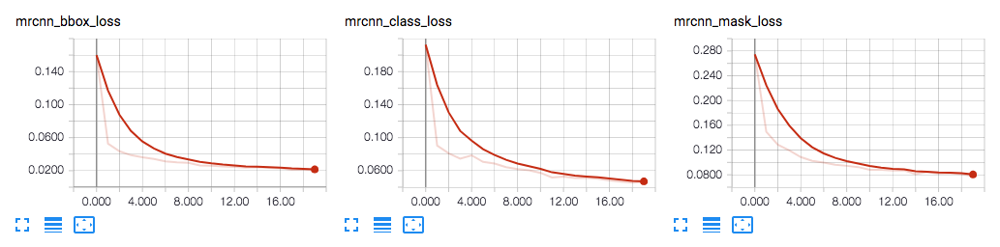
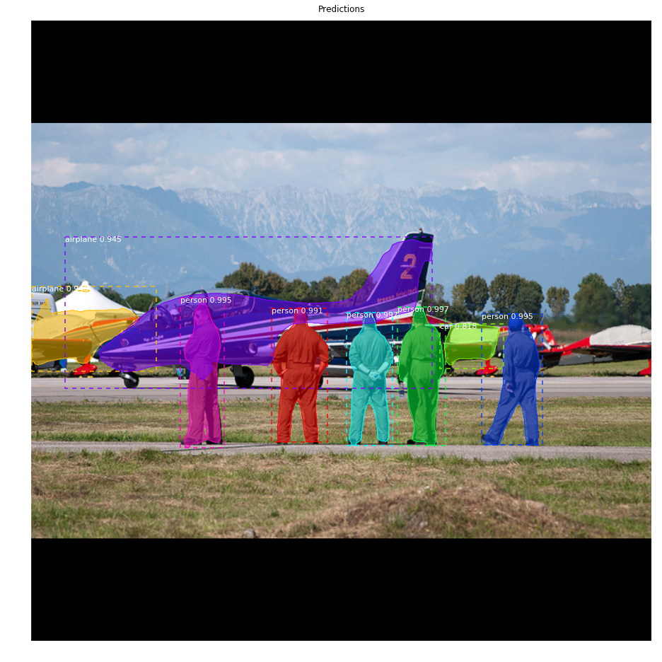

# Mask R-CNN for Object Detection and Segmentation on the Videos and Images

## Using Google Colab with GPU enabled

The Mask R-CNN model generates bounding boxes and segmentation masks for each instance of an object in the image. It's based on Feature Pyramid Network (FPN) and a ResNet101 backbone.This is simple, flexible, and general framework for object instance segmentation. The method Mask R-CNN efficiently detects objects in an image while simultaneously generating a high-quality segmentation mask for each instance.

The method, called Mask R-CNN, extends Faster R-CNN by adding a branch for predicting an object mask in parallel with the existing branch for bounding box recognition. Mask R-CNN is simple to train and adds only a small overhead to Faster R-CNN, running at 5 fps.

# Step by Step Detection

## 1. Anchor sorting and filtering
Visualizes every step of the first stage Region Proposal Network and displays positive and negative anchors along with anchor box refinement.

## 2. Bounding Box Refinement
This is an example of final detection boxes (dotted lines) and the refinement applied to them (solid lines) in the second stage.

## 3. Mask Generation
Examples of generated masks. These then get scaled and placed on the image in the right location.

## 4.Layer activations
Often it's useful to inspect the activations at different layers to look for signs of trouble (all zeros or random noise).

## 5. Weight Histograms
Another useful debugging tool is to inspect the weight histograms. These are included in the inspect_weights.ipynb notebook.

## 6. Logging to TensorBoard
TensorBoard is another great debugging and visualization tool. The model is configured to log losses and save weights at the end of every epoch.

## 6. Composing the different pieces into a final result

## Requirements
Python 3.4, TensorFlow 1.3, Keras 2.0.8 and other common packages listed in `requirements.txt`.

### MS COCO Requirements:
To train or test on MS COCO, we also need:
* pycocotools 
* [MS COCO Dataset](http://cocodataset.org/#home)

## 4K Video output
[]

## Images Output

